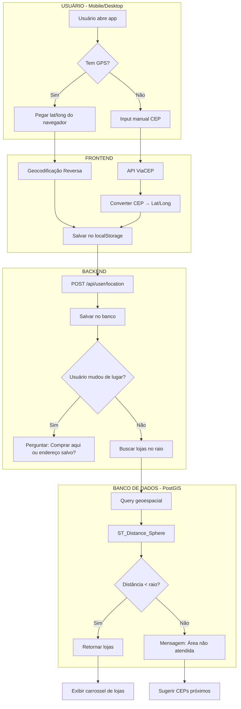
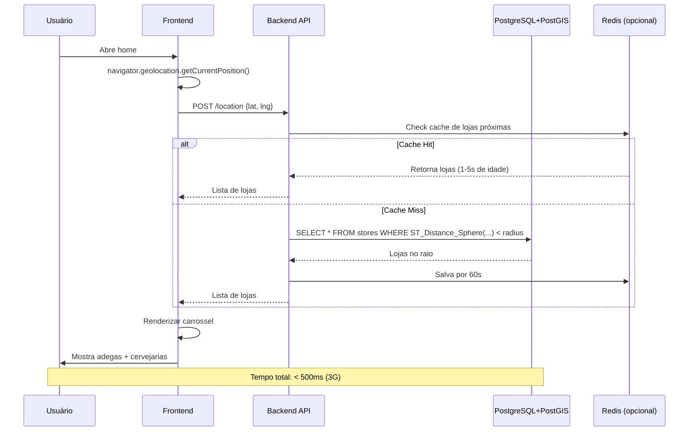
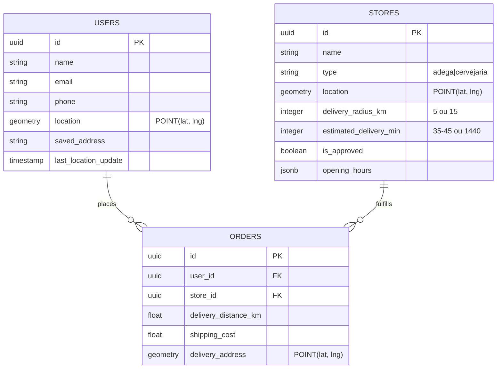
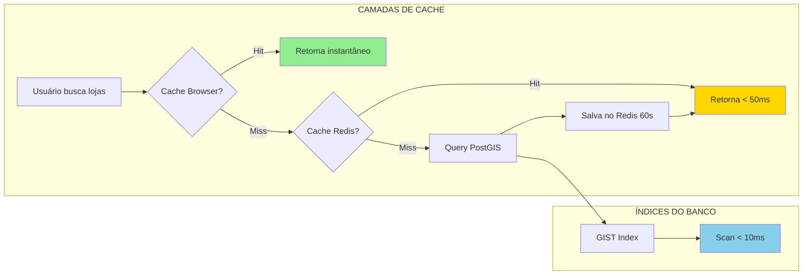

# 🗺️ ARQUITETURA DE GEOLOCALIZAÇÃO - CERVAGELADA
## Solução "Pieter Levels Approved" - Simples, Barata e Funcional

---

## 📊 DIAGRAMA 1: VISÃO GERAL DO SISTEMA



---

## 📊 DIAGRAMA 2: FLUXO DE CÁLCULO DE RAIO



---

## 📊 DIAGRAMA 3: ESTRUTURA DO BANCO DE DADOS



---

## 💻 CÓDIGO FRONTEND - React/React Native

### 1. Hook de Geolocalização

```javascript
// hooks/useGeolocation.js
import { useState, useEffect } from 'react';

export function useGeolocation() {
  const [location, setLocation] = useState(null);
  const [error, setError] = useState(null);
  const [loading, setLoading] = useState(true);

  useEffect(() => {
    // Tentar pegar do localStorage primeiro (cache)
    const cached = localStorage.getItem('userLocation');
    if (cached) {
      const parsed = JSON.parse(cached);
      const age = Date.now() - parsed.timestamp;
      
      // Cache válido por 30 minutos
      if (age < 30 * 60 * 1000) {
        setLocation(parsed);
        setLoading(false);
        return;
      }
    }

    // Verificar se navegador suporta GPS
    if (!navigator.geolocation) {
      setError('GPS não disponível neste dispositivo');
      setLoading(false);
      return;
    }

    // Pegar localização atual
    navigator.geolocation.getCurrentPosition(
      (position) => {
        const loc = {
          latitude: position.coords.latitude,
          longitude: position.coords.longitude,
          accuracy: position.coords.accuracy,
          timestamp: Date.now()
        };
        
        // Salvar no localStorage
        localStorage.setItem('userLocation', JSON.stringify(loc));
        setLocation(loc);
        setLoading(false);
      },
      (err) => {
        console.error('Erro ao pegar localização:', err);
        setError('Não foi possível acessar sua localização');
        setLoading(false);
      },
      {
        enableHighAccuracy: false, // Mais rápido, consome menos bateria
        timeout: 10000, // 10 segundos max
        maximumAge: 300000 // Aceita cache de até 5 minutos
      }
    );
  }, []);

  const refresh = () => {
    setLoading(true);
    localStorage.removeItem('userLocation');
    window.location.reload();
  };

  return { location, error, loading, refresh };
}
```

### 2. Componente de Input de CEP (Fallback)

```javascript
// components/AddressInput.jsx
import React, { useState } from 'react';

export function AddressInput({ onAddressConfirmed }) {
  const [cep, setCep] = useState('');
  const [loading, setLoading] = useState(false);
  const [error, setError] = useState(null);

  const handleCepSearch = async () => {
    // Remover caracteres não numéricos
    const cleanCep = cep.replace(/\D/g, '');
    
    if (cleanCep.length !== 8) {
      setError('CEP inválido. Digite 8 dígitos.');
      return;
    }

    setLoading(true);
    setError(null);

    try {
      // 1. Buscar endereço pelo CEP (ViaCEP - GRÁTIS)
      const viaCepResponse = await fetch(
        `https://viacep.com.br/ws/${cleanCep}/json/`
      );
      
      if (!viaCepResponse.ok) {
        throw new Error('CEP não encontrado');
      }

      const addressData = await viaCepResponse.json();
      
      if (addressData.erro) {
        throw new Error('CEP não encontrado');
      }

      // 2. Converter endereço → lat/lng (Nominatim - GRÁTIS)
      const query = `${addressData.logradouro}, ${addressData.bairro}, ${addressData.localidade}, ${addressData.uf}`;
      const nominatimResponse = await fetch(
        `https://nominatim.openstreetmap.org/search?format=json&q=${encodeURIComponent(query)}&limit=1`,
        {
          headers: {
            'User-Agent': 'CervaGelada/1.0' // Nominatim exige User-Agent
          }
        }
      );

      const geoData = await nominatimResponse.json();
      
      if (geoData.length === 0) {
        throw new Error('Não foi possível localizar este endereço');
      }

      const location = {
        latitude: parseFloat(geoData[0].lat),
        longitude: parseFloat(geoData[0].lon),
        address: addressData,
        timestamp: Date.now()
      };

      // Salvar no localStorage
      localStorage.setItem('userLocation', JSON.stringify(location));
      
      onAddressConfirmed(location);
    } catch (err) {
      setError(err.message);
    } finally {
      setLoading(false);
    }
  };

  return (
    <div className="address-input">
      <input
        type="text"
        placeholder="Digite seu CEP"
        value={cep}
        onChange={(e) => setCep(e.target.value)}
        maxLength={9}
      />
      <button onClick={handleCepSearch} disabled={loading}>
        {loading ? 'Buscando...' : 'Confirmar'}
      </button>
      {error && <p className="error">{error}</p>}
    </div>
  );
}
```

---

## 💻 CÓDIGO BACKEND - Node.js + PostgreSQL

### 1. Configuração do PostGIS

```sql
-- Ativar extensão PostGIS
CREATE EXTENSION IF NOT EXISTS postgis;

-- Tabela de lojas com índice geoespacial
CREATE TABLE stores (
  id UUID PRIMARY KEY DEFAULT gen_random_uuid(),
  name VARCHAR(255) NOT NULL,
  type VARCHAR(20) CHECK (type IN ('adega', 'cervejaria')),
  location GEOGRAPHY(POINT, 4326) NOT NULL, -- lat/lng
  delivery_radius_km INTEGER NOT NULL, -- 5 ou 15
  estimated_delivery_min INTEGER NOT NULL, -- 35-45 ou 1440
  is_approved BOOLEAN DEFAULT false,
  created_at TIMESTAMP DEFAULT NOW()
);

-- CRUCIAL: Criar índice GIST para performance
CREATE INDEX idx_stores_location ON stores USING GIST(location);

-- Exemplo de inserção
INSERT INTO stores (name, type, location, delivery_radius_km, estimated_delivery_min, is_approved)
VALUES (
  'Adega do Zé',
  'adega',
  ST_SetSRID(ST_MakePoint(-49.2730, -25.4284), 4326), -- Curitiba
  5,
  40,
  true
);
```

### 2. API de Busca de Lojas no Raio

```javascript
// routes/stores.js
const express = require('express');
const router = express.Router();
const db = require('../db'); // Pool do PostgreSQL

/**
 * POST /api/stores/nearby
 * Body: { latitude: -25.4284, longitude: -49.2730 }
 * Retorna lojas no raio de atuação
 */
router.post('/nearby', async (req, res) => {
  try {
    const { latitude, longitude } = req.body;

    // Validação básica
    if (!latitude || !longitude) {
      return res.status(400).json({ 
        error: 'Latitude e longitude são obrigatórios' 
      });
    }

    // Validar range
    if (latitude < -90 || latitude > 90 || longitude < -180 || longitude > 180) {
      return res.status(400).json({ 
        error: 'Coordenadas inválidas' 
      });
    }

    const userPoint = `SRID=4326;POINT(${longitude} ${latitude})`;

    // Query otimizada com PostGIS
    const query = `
      SELECT 
        id,
        name,
        type,
        ST_X(location::geometry) as longitude,
        ST_Y(location::geometry) as latitude,
        delivery_radius_km,
        estimated_delivery_min,
        -- Calcular distância real em KM
        ROUND(
          ST_Distance(
            location,
            ST_GeogFromText($1)
          )::numeric / 1000, 
          2
        ) as distance_km
      FROM stores
      WHERE 
        is_approved = true
        AND ST_DWithin(
          location,
          ST_GeogFromText($1),
          delivery_radius_km * 1000 -- converter km para metros
        )
      ORDER BY distance_km ASC
      LIMIT 20;
    `;

    const result = await db.query(query, [userPoint]);

    // Separar por tipo
    const adegas = result.rows.filter(s => s.type === 'adega');
    const cervejarias = result.rows.filter(s => s.type === 'cervejaria');

    res.json({
      success: true,
      userLocation: { latitude, longitude },
      stores: {
        adegas,
        cervejarias
      },
      total: result.rows.length
    });

  } catch (error) {
    console.error('Erro ao buscar lojas:', error);
    res.status(500).json({ 
      error: 'Erro ao buscar lojas próximas' 
    });
  }
});

/**
 * GET /api/stores/coverage-check/:cep
 * Verifica se CEP tem cobertura (útil para marketing)
 */
router.get('/coverage-check/:cep', async (req, res) => {
  try {
    const { cep } = req.params;
    const cleanCep = cep.replace(/\D/g, '');

    // 1. Buscar lat/lng do CEP via ViaCEP + Nominatim
    // (mesmo código do frontend)
    
    // 2. Verificar se tem lojas
    const hasStores = await checkStoresInRadius(latitude, longitude);

    res.json({
      cep: cleanCep,
      hasCoverage: hasStores,
      message: hasStores 
        ? 'Temos lojas na sua região!' 
        : 'Em breve chegaremos aí!'
    });

  } catch (error) {
    res.status(500).json({ error: 'Erro ao verificar cobertura' });
  }
});

module.exports = router;
```

### 3. Função de Cálculo de Frete

```javascript
// utils/shipping.js

/**
 * Calcula custo do frete baseado na distância
 * Regra do CervaGelada:
 * - Taxa mínima: R$ 4,99
 * - Até 5km: só taxa mínima
 * - Acima de 5km: R$ 1,00 por km (ida + volta)
 */
function calculateShippingCost(distanceKm) {
  const BASE_FEE = 4.99;
  const FREE_DISTANCE_KM = 5;
  const EXTRA_COST_PER_KM = 1.00;

  if (distanceKm <= FREE_DISTANCE_KM) {
    return {
      cost: BASE_FEE,
      breakdown: {
        baseFee: BASE_FEE,
        extraKmCost: 0,
        roundTripKm: 0
      }
    };
  }

  // Distância extra além dos 5km gratuitos
  const extraDistance = distanceKm - FREE_DISTANCE_KM;
  
  // Ida + volta
  const roundTripKm = extraDistance * 2;
  
  // Arredondar para cima
  const roundedKm = Math.ceil(roundTripKm);
  
  const extraCost = roundedKm * EXTRA_COST_PER_KM;
  const totalCost = BASE_FEE + extraCost;

  return {
    cost: parseFloat(totalCost.toFixed(2)),
    breakdown: {
      baseFee: BASE_FEE,
      extraKmCost: extraCost,
      roundTripKm: roundedKm
    }
  };
}

// Testes unitários (UNCLE BOB APPROVED!)
function testShippingCalculation() {
  const tests = [
    { distance: 3, expected: 4.99 },
    { distance: 5, expected: 4.99 },
    { distance: 6, expected: 6.99 }, // 1km extra * 2 (ida+volta) = 2km * 1 = 2 + 4.99
    { distance: 7.5, expected: 9.99 }, // 2.5km extra * 2 = 5km → arredonda 5 * 1 = 5 + 4.99
  ];

  tests.forEach(test => {
    const result = calculateShippingCost(test.distance);
    console.assert(
      result.cost === test.expected,
      `Erro: ${test.distance}km deveria custar R$ ${test.expected}, mas retornou R$ ${result.cost}`
    );
  });

  console.log('✅ Todos os testes de frete passaram!');
}

module.exports = { calculateShippingCost, testShippingCalculation };
```

---

## 📊 DIAGRAMA 4: OTIMIZAÇÕES DE PERFORMANCE



**TTL (Time To Live) Recomendados:**
- **Browser (localStorage):** 30 minutos
- **Redis:** 60 segundos (balanceia freshness vs carga no DB)
- **PostGIS:** Sempre fresh (mas com índice GIST é rápido)

---

## 💰 ANÁLISE DE CUSTOS

### Opção 1: "Pieter Levels Approved" (R$ 0/mês)

| Serviço | Custo | Limite |
|---------|-------|--------|
| ViaCEP | Grátis | Ilimitado |
| Nominatim (OpenStreetMap) | Grátis | 1 req/segundo |
| PostGIS (self-hosted) | Grátis | Infinito |
| Leaflet.js (mapa visual) | Grátis | Infinito |

**Total:** R$ 0/mês até 100k usuários

### Opção 2: "Se escalar muito" (R$ 50-200/mês)

| Serviço | Custo | Limite |
|---------|-------|--------|
| Google Maps Geocoding API | $5/1000 reqs | 40k grátis/mês |
| Mapbox (se quiser mapa bonito) | $0 | 50k map loads grátis |
| Redis Cloud (cache) | $0-50 | 30MB grátis |

**Total:** R$ 50-200/mês para 500k usuários

---

## 🧪 CHECKLIST DE VALIDAÇÃO

### Frontend:
- [ ] GPS funciona em iOS Safari?
- [ ] GPS funciona em Android Chrome?
- [ ] Fallback para CEP funciona?
- [ ] Cache no localStorage está salvando?
- [ ] Tempo de resposta < 2s em 3G?
- [ ] Mensagem clara se não houver lojas?

### Backend:
- [ ] Índice GIST criado na tabela stores?
- [ ] Query retorna em < 100ms?
- [ ] Teste com 10k lojas no banco (performance)?
- [ ] Validação de coordenadas inválidas?
- [ ] Logs de erro estão funcionando?
- [ ] Cálculo de frete tem testes unitários?

### Integração:
- [ ] ViaCEP está respondendo?
- [ ] Nominatim tem rate limit configurado?
- [ ] Fallback se API externa cair?

---

## 🚀 PRÓXIMOS PASSOS (FASE 2)

1. **Geocoding Reverso Premium:** Se Nominatim ficar lento, migrar para Google Maps API
2. **Predição de Rota:** Usar Mapbox Directions API para calcular tempo real de entrega
3. **Zonas de Entrega:** Ao invés de raio circular, desenhar polígonos (alguns bairros sim, outros não)
4. **ML para Estimativa:** Usar histórico de entregas para prever tempo real (chuva, trânsito)

---

## 📞 TROUBLESHOOTING COMUM

**Problema:** Nominatim retorna erro 429 (rate limit)
**Solução:** Implementar queue com delay de 1s entre requests

**Problema:** PostGIS query lenta (> 500ms)
**Solução:** Verificar se índice GIST existe: `\d stores` no psql

**Problema:** GPS não funciona no iOS
**Solução:** HTTPS obrigatório, adicionar permissão no Info.plist

**Problema:** Usuário reclama "não tem lojas"
**Solução:** Verificar se raio de 15km está muito curto para cidade dele
